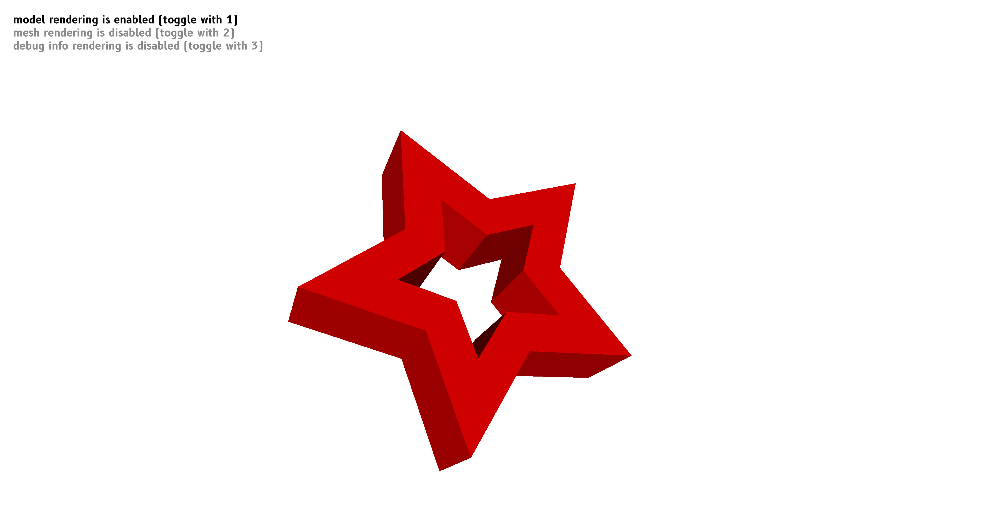

+++
title = "Fornjot 0.5.0"
date  = 2022-01-27
+++

[Fornjot](https://www.fornjot.app/) is a next-generation Code-CAD application, and this is the announcement of its new release, version 0.5.0.

Fornjot is still at an early stage and far from being useful as a general CAD application. The project is steadily inching forward, however, and this new version comes with support for more platforms, more flexible tools for defining CAD models, various fixes to make doing so more robust, and lots of internal clean-ups to enable future improvements.


### Sponsors

Fornjot is supported by [@lthiery](https://github.com/lthiery), [@Yatekii](https://github.com/Yatekii), and [my other awesome sponsors](https://github.com/sponsors/hannobraun).

If you're interested in making the project sustainable long-term, please consider [supporting me](https://github.com/sponsors/hannobraun).


### Support for Windows and macOS

I develop Fornjot on Linux, but broad platform support was always part of the plan. With this release, we're getting closer to that goal. Support for Windows and macOS was added by [@Bandsberg](https://github.com/Bandsberg), Fornjot's very first contributor.


### Sketches

The concept of a sketch (represented by [`fj::Sketch`](https://docs.rs/fj/0.5.0/fj/struct.Sketch.html)) was introduced. Right now, it is a more flexible replacement for (the now removed) `fj::Rectangle`, and only allows for making sketches with straight edges.

Like `fj::Rectangle`, `fj::Sketch` can be extruded into a 3D model, and limited support for combining sketches exists.



While this is very limited, don't forget that Fornjot is a Code-CAD application, and you can generate these sketches programmatically, from the Rust code that defines your model. This should allow for approximations of more complex shapes.

In the future, `fj::Sketch` will subsume [`fj::Circle`](https://docs.rs/fj/0.5.0/fj/struct.Circle.html) to allow for sketches with arcs. Long-term, support for more powerful concepts like Bézier curves/B-spline/NURBS is a goal.


### Unions and Transformations

Once you have created some 3D models by extruding sketches, you can combine them using [`fj::Union`](https://docs.rs/fj/0.5.0/fj/struct.Union.html) and transform them using [`fj::Transform`](https://docs.rs/fj/0.5.0/fj/struct.Transform.html).

Both of these operations are still subject to limitations and will be improved in future versions.


### Convenient Syntax

Some extension traits have been added to the [`fj`](https://docs.rs/fj/0.5.0/fj/) library, to provide more convenient syntax for the various operations the library supports.

``` rust
let side = [
    [          0.,          0.],
    [inner_height,          0.],
    [inner_height, outer_depth],
    [          0., outer_depth],
];
let side = side
    .sketch()
    .sweep(material_strength)
    .rotate([0., 1., 0.], -FRAC_PI_2)
    .translate([0., 0., material_strength]);
```


### Fixes and Clean-ups

Some small issues have been fixes, around the camera behavior, triangle mesh generation, and reloading models (special thanks for that last one to first-time contributor [@mxdamien](https://github.com/mxdamien)).

In addition, there has been a huge amount of clean-up, focused on the CAD kernel, to make the software architecture more robust and pave the way for adding more features in the future.


### More Details

To learn more, check out the [release on GitHub](https://github.com/hannobraun/Fornjot/releases/tag/v0.5.0).
